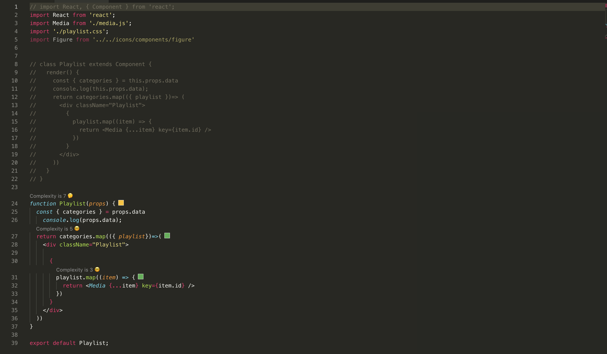

# fundamentos-programacion
Fundamentos de Programación por Julian Nicholls Cardona

## ¿Qué es HTML/CSS/JS?

#### Html

Es un lenguaje de marcado de hipertexto y hay colocamos la información donde no tiene interactividad en texto plano que nos permite definir el contenido de información con extensión de .html en sus archivos, pura información de formulario en el cual se le puede asignar caracteristicas atraves de id "xnombre" para darle caracteristicas a la hora de visualizar en el navegador.

#### CSS

Es un lenguaje que no tiene interactividad con el objectivo de darle apariencia a un lenguaje marcado como Html, un lenguaje de hoja de estilo en cascada en texto plano, donde defines colores, tipografia, tamaño y posición; caracteristicas a un objecto que recibe fácilmente con una id asignada, con una  extensión en .css.

#### JS

Es uno de los lenguajes de programación más importantes en la web, que define la interactividad que tendra el html en la página web que no necesita compilacion ya que funciona al lado del cliente creado para trabajar en prototipos para el uso
de la herencia, un lenguaje multiplataformas, con un codigo liviano, donde puedes tarbajar tanto en Frontend o Backend dependiendo con que framework quieras usarlo, es imperativo y estructurado, mediante un conjunto de instrucciones indica al computador qué tarea debe realizar, no es necesario compilarse para ser ejecutado, con una  extensión en .js.

------------------------------------------------------------------------------------------------------------------------------

## ¿Que es  Framework?

Son un conjunto de librerias para  el proceso de desarrollo volver más liviano, Representa una arquitectura de software que modela las relaciones generales de las entidades del dominio. Provee una estructura y una metodología de trabajo la cual extiende o utiliza las aplicaciones del dominio.

Son diseñados con la intención de facilitar el desarrollo de software, permitiendo a los diseñadores y programadores pasar más tiempo identificando requerimientos de software que tratando con los tediosos detalles de bajo nivel de proveer un sistema funcional. 

##### ¿Qué ventajas tiene utilizar un ‘framework’?

Las que se derivan de utilizar un estándar; entre otras:

El programador no necesita plantearse una estructura global de la aplicación, sino que el framework le proporciona un esqueleto que hay que “rellenar”.
Facilita la colaboración. Cualquiera que haya tenido que “pelearse” con el código fuente de otro programador (¡o incluso con el propio, pasado algún tiempo!) sabrá lo difícil que es entenderlo y modificarlo; por tanto, todo lo que sea definir y estandarizar va a ahorrar tiempo y trabajo a los desarrollos colaborativos.
Es más fácil encontrar herramientas (utilidades, librerías) adaptadas al framework concreto para facilitar el desarrollo.

